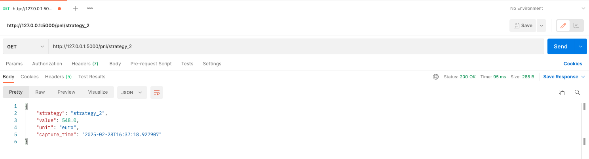

# Installation and Running the Tasks

## 1. Install Dependencies  
Install dependencies using the `requirements.txt` file:  
```bash
pip install -r requirements.txt
```

## 2. Running Task 1  
Run the script below in your terminal:  
```bash
cd task_1
python execute_task_1.py
```

This will execute:  
- **Task 1.1** (`pnl_calculations.py`): Calculate total buy/sell volume.  
- **Task 1.2** (`pnl_calculations.py`): Calculate Profit and Loss (PnL).  
- **Task 1.3** (`app.py`): Start the Flask API endpoint.  

## 2.1 Testing the API (Task 1.3)  
After running Task 1.3:  
1. The Flask server starts.  
2. Test the API endpoint (e.g., with `curl`, Postman, or a browser).  
3. Press `CTRL+C` to stop the server.  

### How to Access the API Endpoint:  
1. **The Flask server starts**:  
   ```bash
   python app.py
   ```

2. **Test the API**:  
   - Open browser and navigate to:  
     ```
     http://127.0.0.1:5000/pnl/<string:strategy_id>
     ```  

3. **Stop the Flask server**:  
   - Press `CTRL+C` in the terminal to stop the server.  

**Example API Test**:  
  
*FIG: Example of testing the API endpoint*   

## Running Task 2
Run the script below in your terminal:  
```bash
cd task_2
python execute_task_2.py
```

This will execute:  
- (`analysis.py`): Solves whole questions from 2.1 to 2.6.  
- (`trade_strategy.py`): Trading strategy question number 2.7. 

## Battery revenue  task 2.6

## Optimized Battery Trading Strategy

### Overview
This strategy optimizes revenue generation using a **1 MWh battery** by dynamically selecting the best times to **charge** and **discharge** based on **both Day Ahead (DA) and Intraday (ID) prices**.

---

### Intial Approach (Using Only DA Prices)
1. **For each day:**
   - Sort **Day Ahead Prices**.
   - Select the **12 lowest hours** for **charging**.
   - Select the **12 highest hours** for **discharging**.
   - Compute revenue as:

     ```
     Total Revenue = Σ(Discharge Prices) - Σ(Charge Prices)
     ```

2. **Limitation**: This approach **ignores Intraday Prices**, potentially missing better charge/discharge opportunities.

---

### Improved Approach (Using Both DA and ID Prices)
1. **For each day:**
   - Instead of using **only DA prices**, consider **both DA and ID prices** at every hour.
   - Create two new columns:
     - **Best Charge Price**: The lowest price between DA and ID for that hour.
     - **Best Discharge Price**: The highest price between DA and ID for that hour.
   - Select:
     - The **12 best hours for charging** (lowest prices from "Best Charge Price").
     - The **12 best hours for discharging** (highest prices from "Best Discharge Price").
   - Compute revenue using these optimized values.

---

### Why This is Better?
✅ **Considers both DA and ID prices → More accurate market behavior**  
✅ **Dynamically selects the best hours instead of blindly picking 12 hours in DA**  
✅ **Maximizes revenue by charging at the lowest possible price and discharging at the highest**  

---

### Example Calculation
For a given day, the following prices are available:

| Hour  | DA Price (€) | ID Price (€) | Best Charge Price (€) | Best Discharge Price (€) |
|-------|------------|------------|------------------|------------------|
| 00:00 | 50 | 45 | 45 | 50 |
| 01:00 | 48 | 47 | 47 | 48 |
| 02:00 | 40 | 42 | 40 | 42 |
| 12:00 | 60 | 62 | 60 | 62 |
| 18:00 | 80 | 85 | 80 | 85 |
| 22:00 | 100 | 95 | 95 | 100 |

- **Old Approach:** Would only look at DA Prices and pick **50 for charging**.
- **New Approach:** Finds **45 in ID market**, leading to higher profit.

By always **charging at the lowest and discharging at the highest price available**, this strategy significantly increases revenue while maintaining the same battery capacity.

---


## Trading Conditions for 2.7

For each hour of the day, check whether the conditions meet the following, idea: More renewable day ahead forecast so less DA price and low renewable intraday forecast more the intraday price :

- **Buy Condition (Day Ahead market)**:  
  If the forecasted renewable production day ahead (Wind + PV) is above average for the day, and the Day Ahead price is below its average for the day, **buy the energy**.

- **Sell Condition (Intraday market)**:  
  If the forecasted renewable production intraday (Wind + PV) is below average for the day, and the Intraday price is above its average for the day, **sell the energy**.

  
